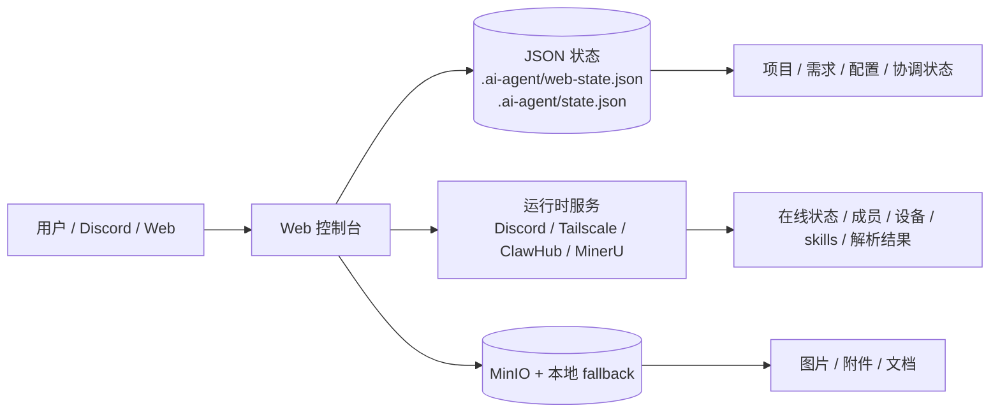
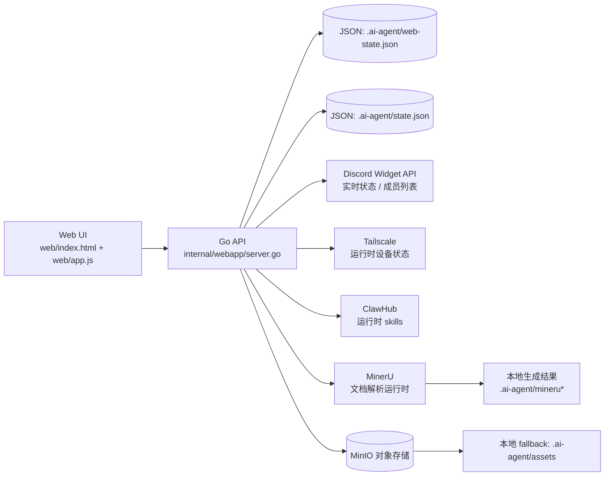
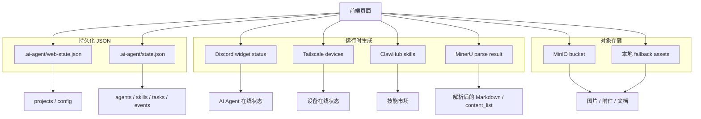
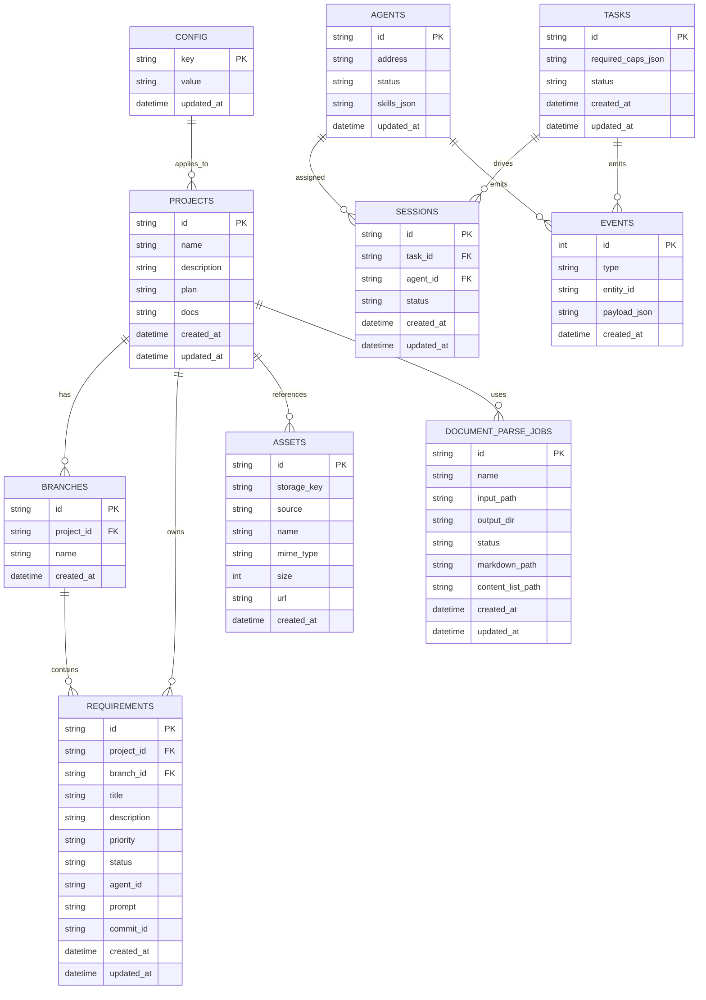

# Mutesolo

让 Discord 成为多 Agent 协作中心 — 在 Web 端实时查看 Agent 项目进度

## 🎯 项目目标

Mutesolo 是一个协调层，让多个 AI Agent（如 OpenClaw）能够在 Discord 中协作完成项目任务，并通过 Web 界面可视化整个流程。

**核心价值：**
- **Discord 作为协作入口**：通过 IM 下发任务给 Agent，人工可随时介入
- **Web 端进度可视化**：项目看板、需求追踪、Agent 状态一目了然
- **任务自动分配**：根据 Agent 能力自动匹配任务
- **结果可追溯**：所有产出物（代码、文档）通过 Git 提交，完整记录

## 🗺️ 一图总览



## ✨ 主要功能

### 1. Web 控制台
- 项目列表与看板视图
- 需求文档编辑器（支持截图、附件）
- 任务详情与进度追踪
- Agent 在线状态监控
- 技能市场浏览与安装

### 2. 本地文档解析
- 使用 MinerU 解析上传的文档（PDF → Markdown）
- 解析后的内容用于生成 LLM 提示词
- 本地处理，保护隐私

### 3. 本地对象存储
- 使用 MinIO 存储需求截图和附件
- 支持 Tailscale 跨设备访问
- 7 天自动清理过期文件

### 4. Agent 协调
- Agent 注册表（A2A 协议）
- 技能注册表（ClawHub）
- 基于能力的任务匹配
- 任务与 Session 状态管理

## 🚀 快速开始

### 启动 Web 控制台

```bash
go run ./cmd/mutesolo-web
```

访问 http://127.0.0.1:8787

### 启动本地存储（可选）

```bash
cp .env.example .env
docker compose up -d minio minio-init
```

### 配置环境变量

```bash
export MUTESOLO_MINIO_ENDPOINT=http://127.0.0.1:9000
export MUTESOLO_MINIO_PUBLIC_URL=http://127.0.0.1:9000
export MUTESOLO_MINIO_BUCKET=Mutesolo-assets
export MUTESOLO_MINIO_ACCESS_KEY=Mutesolo
export MUTESOLO_MINIO_SECRET_KEY=Mutesolo123
export MUTESOLO_ASSET_FALLBACK_DIR=.ai-agent/assets
```

## 🔄 工作流程

```
需求编辑 → 文档解析 → 提示词生成 → Discord 下发 → Agent 执行 → Git 提交 → Web 看板更新
```

1. **需求输入**：在 Web 端编辑需求文档（支持截图、附件）
2. **文档解析**：MinerU 将文档转换为结构化 Markdown
3. **提示词生成**：根据需求生成 Agent 指令
4. **Discord 下发**：通过 Discord 发送给目标 Agent
5. **Agent 执行**：Agent 完成任务并提交到 Git
6. **进度更新**：Web 看板自动同步最新状态

## 🧭 数据流与关系图

### 1) 直观数据流图



### 2) 关系图：哪些是持久化、哪些是运行时、哪些是对象存储



### 3) 读写关系说明

- **JSON**：保存项目、配置、协调状态，是 Mutesolo 的主状态来源。
- **MinIO**：保存上传的图片、附件、文档等对象资源，不承载项目主状态。
- **运行时数据**：Discord、Tailscale、ClawHub、MinerU 等每次请求实时获取或即时生成，不会自动变成主状态。

### 4) 写入流 vs 读取流

```mermaid
flowchart TB
  subgraph 写入流
    W1[Web 表单保存]\n    W2[项目 / 需求编辑]\n    W3[文件上传]\n    W4[文档解析请求]
  end

  subgraph 读取流
    R1[前端页面渲染]\n    R2[项目看板 / 任务详情]\n    R3[AI Agent 在线状态]\n    R4[附件 / 图片展示]\n    R5[解析后的 Markdown]
  end

  W1 --> S1[(.ai-agent/web-state.json)]
  W2 --> S1
  W3 --> S2[(MinIO + .ai-agent/assets)]
  W4 --> S3[(.ai-agent/mineru* 输出)]

  S1 --> R1
  S1 --> R2
  S1 --> R5
  S2 --> R4
  S3 --> R5

  R3 <-->|请求时实时拉取| D1[Discord Widget API]
  R1 <-->|请求时读取| S1
  R2 <-->|请求时读取| S1
  R4 <-->|静态/对象访问| S2
  R5 <-->|读取结果文件| S3
```

- **写入 JSON**：保存配置、项目、需求、协调状态。
- **写入 MinIO**：保存上传的资产文件，浏览器最终通过本地 fallback /assets 访问。
- **写入运行时输出**：MinerU 解析结果落到本地输出目录，供页面读取。
- **读取运行时状态**：Discord 在线信息、成员列表等每次请求实时从 Discord Widget API 拉取。

## 🗄️ 数据存储设计

Mutesolo 当前的数据流大致分成三类：

- **JSON 主状态**：`.ai-agent/web-state.json`、`.ai-agent/state.json`，用于当前页面与协调层状态
- **对象存储**：MinIO + `.ai-agent/assets`，用于图片、附件、文档等文件资源
- **运行时数据**：Discord Widget、Tailscale、ClawHub、MinerU 等实时/派生数据

随着项目继续增长，主状态建议从 JSON 迁移到 **SQLite**，把“项目 / 需求 / 配置 / 协调状态”统一收敛到一个轻量、可事务、可查询的本地数据库里。

### SQLite 表结构 ER 图



### JSON → SQLite 迁移方案

#### 导入顺序与合并规则

迁移脚本会按下面的顺序做合并导入：

1. 读取当前 `.ai-agent/web-state.json`
2. 如果存在，再合并旧的 `.openclaw/web-state.json`
3. 读取协调层状态：`.ai-agent/state.json`
4. 如果存在，再合并旧的 `.openclaw/state.json`
5. 以 **当前状态优先、旧状态兜底** 的方式落库

冲突规则：

- **同名配置**：当前 JSON 覆盖旧 JSON
- **同 ID 项目/分支/需求**：按 ID 合并，当前 JSON 的非空字段覆盖旧值
- **协调层实体**：`agents / skills / tasks / sessions` 按 ID 合并
- **events**：按时间顺序追加，不做强制去重（这是 draft 版脚本的明确约束）

#### Phase 1：主状态迁移
先把最关键、最容易丢数据的内容迁到 SQLite：

- `config`
- `projects`
- `branches`
- `requirements`

#### Phase 2：协调层迁移
再把运行协调相关的数据结构化：

- `agents`
- `skills`
- `tasks`
- `sessions`
- `events`

#### Phase 3：元数据迁移
最后把辅助元数据补齐：

- `assets`
- `document_parse_jobs`

#### 迁移脚本的行为

- 脚本路径：`scripts/migrate_json_to_sqlite.py`
- 支持 `--dry-run`，会打印本次会导入哪些来源文件
- 正式运行会输出导入摘要：各表写入数量 + 数据库中最终行数
- `assets` / `document_parse_jobs` 作为可扩展入口保留，未来如果 JSON 里出现对应清单就可直接导入

#### 迁移原则

- **双读单写过渡**：读可以兼容 JSON，写优先 SQLite
- **事务优先**：新增项目、需求、配置保存都必须在事务里完成
- **MinIO 继续存文件**：SQLite 只存元数据，不存大文件内容
- **运行时数据不落主库**：Discord / Tailscale / ClawHub / MinerU 仍保持实时拉取

### SQLite 建表 SQL 草案

可执行版本已拆分到仓库根目录的 `schema.sql`。下面保留的是结构索引，完整 SQL 以 `schema.sql` 为准。

- `PRAGMA journal_mode = WAL`
- `config` / `projects` / `branches` / `requirements`
- `agents` / `skills` / `tasks` / `sessions` / `events`
- `assets` / `document_parse_jobs`
- 迁移脚本草案：`scripts/migrate_json_to_sqlite.py`

### 迁移后的 Go 读取层设计

这一步的目标不是“立刻推翻 JSON”，而是**平滑切换读取层**：

#### 第一阶段：启动时先初始化 SQLite

- `cmd/mutesolo-web/main.go` 在启动 HTTP server 前，先调用 `webapp.EnsureSQLiteInitialized(...)`
- 如果 `/.ai-agent/mutesolo.db` 不存在或是空文件，就运行 `scripts/migrate_json_to_sqlite.py`
- 数据来源顺序保持：
  1. 当前 JSON
  2. 旧 JSON 兜底
  3. 迁移进 SQLite

#### 第二阶段：定义统一仓储接口

建议把读取层收敛成接口，避免 handler 直接知道 JSON / SQLite 的细节：

```go
type Repository interface {
    LoadConfig(ctx context.Context) (Config, error)
    SaveConfig(ctx context.Context, cfg Config) error

    ListProjects(ctx context.Context) ([]Project, error)
    UpsertProject(ctx context.Context, project Project) error
    GetProject(ctx context.Context, id string) (Project, error)

    ListRequirements(ctx context.Context, projectID string) ([]Requirement, error)
    UpsertRequirement(ctx context.Context, req Requirement) error

    LoadCoordinationState(ctx context.Context) (coordination.State, error)
    SaveCoordinationState(ctx context.Context, state coordination.State) error
}
```

#### 第三阶段：SQLite 成为主读写层

- `handleState` / `handleConfig` / `handleProjects` 优先读 SQLite
- 写入时优先走 SQLite 事务
- JSON 只做回退导入或导出快照，不再是主存储
- 协调层 `agents / tasks / sessions / events` 也逐步迁到 SQLite

#### 第四阶段：JSON 退场，但保留导出

- 启动时仍可从 JSON 迁入 SQLite
- 日常运行不再依赖 JSON 作为主状态
- 可以保留一个“导出回 JSON”的维护命令，方便人工排查和迁移回滚

#### 推荐目录拆分

```text
internal/storage/sqlite/      # SQLite schema、查询、事务
internal/storage/json/        # JSON 兜底读取 / 导入导出
internal/webapp/repository.go # Web 层仓储抽象
internal/coordination/repo.go # 协调层仓储抽象
```

### 迁移原则

- **双读单写过渡**：读可以兼容 JSON，写优先 SQLite
- **事务优先**：新增项目、需求、配置保存都必须在事务里完成
- **MinIO 继续存文件**：SQLite 只存元数据，不存大文件内容
- **运行时数据不落主库**：Discord / Tailscale / ClawHub / MinerU 仍保持实时拉取

### 核心组件

- **Web 控制台**（Go + Vue）：项目管理与可视化
- **CLI 工具**（`opclawctl`）：Agent/Skill/Task 管理
- **文档解析器**（MinerU）：PDF → Markdown 转换
- **对象存储**（MinIO）：附件与截图存储
- **协调层**：任务匹配、状态管理、事件追踪

### 数据模型

- **Agent**：ID、地址、状态、技能列表
- **Skill**：ID、能力列表、版本
- **Task**：ID、所需能力、状态
- **Session**：ID、Agent ID、Task ID、状态
- **Event**：类型、实体 ID、载荷、时间戳

## 📝 技术栈

- **后端**：Go
- **前端**：Vue 3 + Vite
- **存储**：MinIO（对象存储）
- **文档解析**：MinerU
- **协议**：A2A（Agent-to-Agent）
- **技能市场**：ClawHub

## 🔒 安全说明

- 所有文档解析在本地完成，不上传到云端
- LLM 提示词生成受控，不会自动执行代码
- Discord 交互采用人工确认模式（human-in-the-loop）
- Git 提交需要手动确认

## 📚 相关文档

- [MinerU 本地解析配置](docs/mineru-native.md)
- [需求编辑器说明](webapps/requirement-editor/README.md)

---

**Mutesolo** — 让 AI Agent 协作像人类团队一样简单
